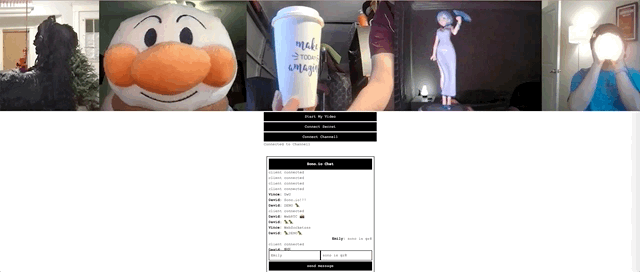

# sono.io

A real-time communication module for Deno.



## Features

- A WebSocket server module for the Deno runtime that accepts WebSocket connections
- A Websocket client module for to interface with the sono server-side module with myriad built-in methods for peer-to-peer communication.
- A WebRTC module for Deno (experimental)

## Documentation
Find the full documentation of Sono.io [here.](http://sono.land)

## Usage/Examples

server.ts:
```typescript
  import { Sono } from 'https://deno.land/x/sono@v1.1/mod.ts';

  const sono = new Sono();
```

client.js:
```javascript
  import { SonoClient } from 'https://deno.land/x/sono@v1.1/src/sonoClient.js';

  const sono = new SonoClient('ws://localhost:8080/ws');

  sono.on('hello', (event) => {
    console.log(event, 'world')
  })
```

  ## Installation

Import directly from deno.land / github.

deps.ts:
```typescript
  import { Sono } from 'https://deno.land/x/sono@v1.1/mod.ts';
```


## Authors

- Chris Ejercito [GitHub](https://github.com/chris-paul-ejercito) [LinkedIn](https://www.linkedin.com/in/christian-paul-ejercito/)
- David Suh [GitHub](https://github.com/DavidJinSuh90) [LinkedIn](https://www.linkedin.com/in/DavidJinSuh/)
- Emily Liu [GitHub](https://github.com/a-creation) [LinkedIn](https://www.linkedin.com/in/eliu00/)
- John Lee [GitHub](https://github.com/JohnL64) [LinkedIn](https://www.linkedin.com/in/john-lee-294a38211/)
- Vince Vu [GitHub](https://github.com/vin-vu) [LinkedIn](https://www.linkedin.com/in/vince-vu-64425b1ba/)
